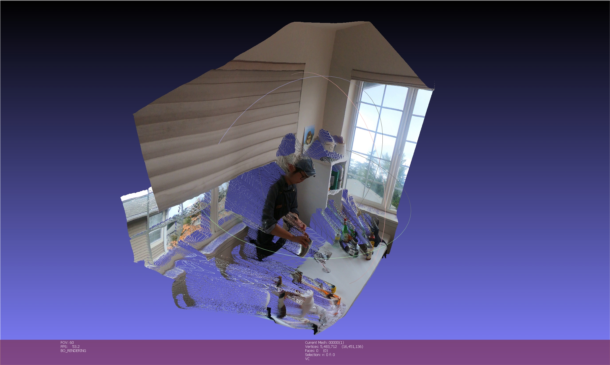
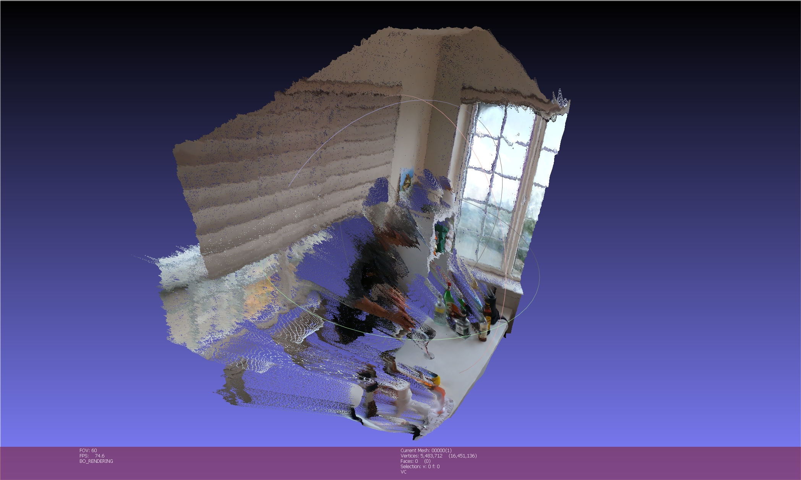
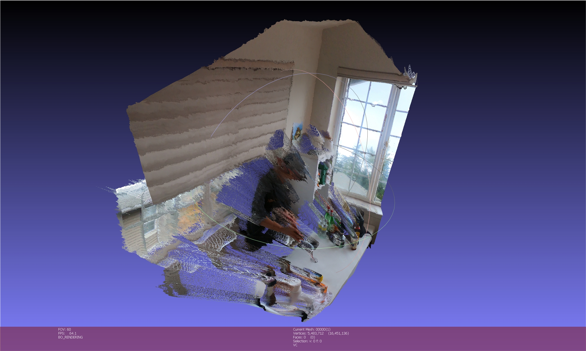
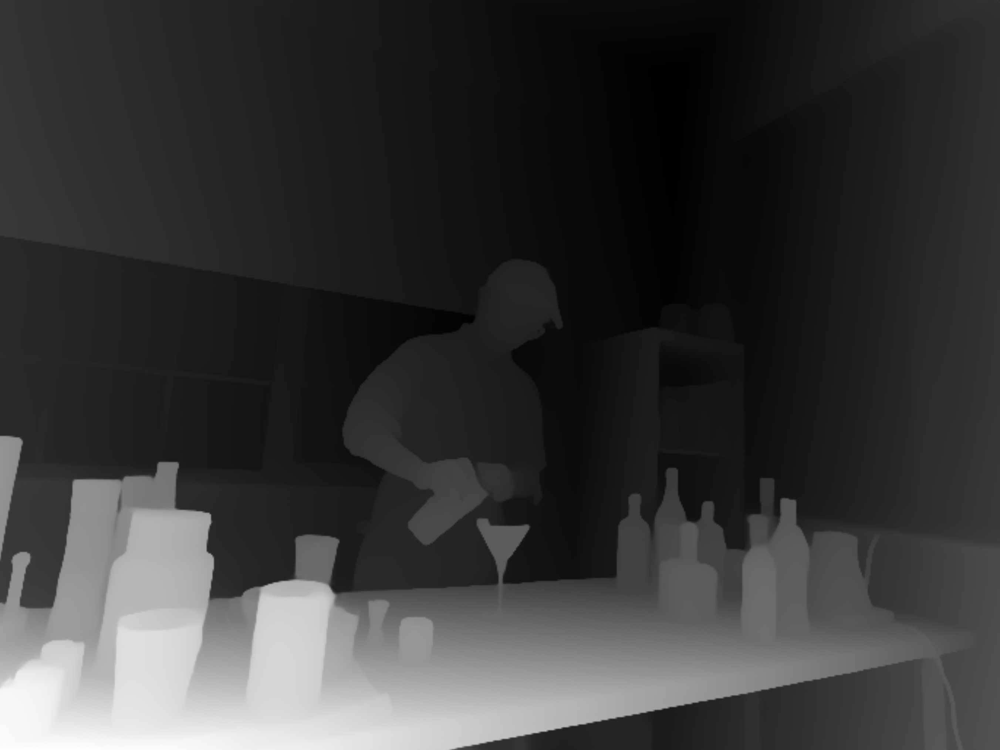
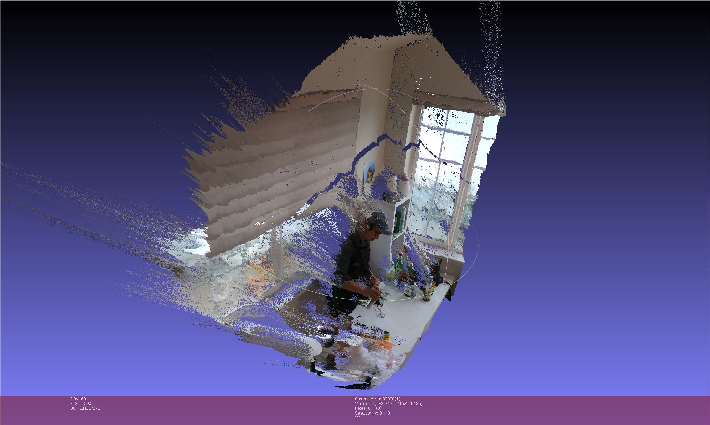
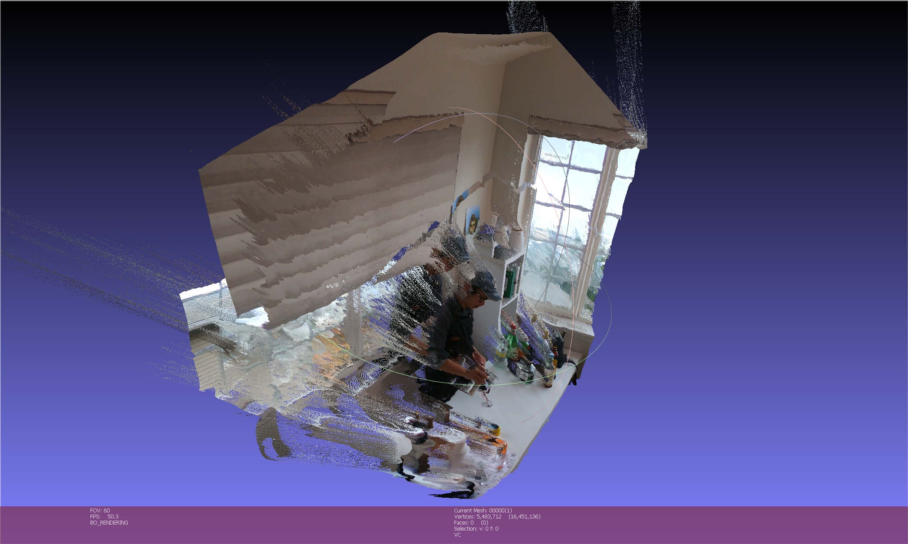

# 3D Gaussian Splatting (Packaged Python Version)

This repo is the **refactored python training and inference code for [3D Gaussian Splatting](https://github.com/graphdeco-inria/gaussian-splatting)**.
Forked from commit [a2a91d9093fd791fb01f556fa717f8d9f2cfbdd7](https://github.com/graphdeco-inria/gaussian-splatting/tree/a2a91d9093fd791fb01f556fa717f8d9f2cfbdd7).
We **refactored the original code following the standard Python package structure**, while **keeping the algorithms used in the code identical to the original version**.

## Features

* [x] organize the code as a standard Python package
* [x] exposure compensation
* [x] camera and 3DGS parameters joint training
* [x] depth regularization
* [x] local relative depth regularization
* [x] image mask
* [x] integrated [gsplat](https://github.com/nerfstudio-project/gsplat) backend
* [x] integrated 2DGS from [gsplat](https://github.com/nerfstudio-project/gsplat)

## Install

### Prerequisites

* [Pytorch](https://pytorch.org/) (>= v2.4 recommended)
* [CUDA Toolkit](https://developer.nvidia.com/cuda-12-4-0-download-archive) (12.4 recommended, match with PyTorch version)
* [gsplat](https://github.com/nerfstudio-project/gsplat)

### PyPI Install

```shell
pip install --upgrade gaussian-splatting
```
or
build latest from source:
```shell
pip install wheel setuptools
pip install --upgrade git+https://github.com/yindaheng98/gaussian-splatting.git@master --no-build-isolation
```

### Development Install

```shell
git clone --recursive https://github.com/yindaheng98/gaussian-splatting
cd gaussian-splatting
pip install tqdm plyfile tifffile numpy opencv-python pillow open3d
pip install --target . --upgrade . --no-deps
```

## Quick Start

1. Download dataset (T&T+DB COLMAP dataset, size 650MB):

```shell
wget https://repo-sam.inria.fr/fungraph/3d-gaussian-splatting/datasets/input/tandt_db.zip -P ./data
unzip data/tandt_db.zip -d data/
```

2. Train 3DGS with densification (same with original 3DGS)
```shell
python -m gaussian_splatting.train -s data/truck -d output/truck -i 30000 --mode densify
```

3. Render 3DGS
```shell
python -m gaussian_splatting.render -s data/truck -d output/truck -i 30000 --mode densify
```

4. Joint training 3DGS and camera (load the trained 3DGS)
```shell
python -m gaussian_splatting.train -s data/truck -d output/truck-camera -i 30000 --mode camera -l output/truck/point_cloud/iteration_30000/point_cloud.ply
```

5. Render 3DGS with optimized cameras
```shell
python -m gaussian_splatting.render -s data/truck -d output/truck-camera -i 30000 --mode camera --load_camera output/truck-camera/cameras.json
```

> 💡 This repo does not contain code for creating dataset.
> If you want to create your own dataset, please refer to [InstantSplat](https://github.com/yindaheng98/InstantSplat) or use [convert.py](https://github.com/graphdeco-inria/gaussian-splatting/blob/main/convert.py).

> 💡 See [.vscode/launch.json](.vscode/launch.json) for more example. See [gaussian_splatting.train](gaussian_splatting/train.py) and [gaussian_splatting.render](gaussian_splatting/render.py) for full options.

### (Optional) Generate depth maps before training

1. Prepare Depth-Anything-V2
```shell
git clone https://github.com/DepthAnything/Depth-Anything-V2.git
mkdir checkpoints
wget -O checkpoints/depth_anything_v2_vitl.pth https://huggingface.co/depth-anything/Depth-Anything-V2-Large/resolve/main/depth_anything_v2_vitl.pth?download=true
```

2. Generate depth maps
```shell
# (Recommanded) save depth map as floating-point tiff file
python tools/run_depth_anything_v2.py --encoder vitl --img-path data/truck/images --outdir data/truck/depths
# (not Recommanded) save depth map as uint8 png file
python Depth-Anything-V2/run.py --encoder vitl --pred-only --grayscale --img-path data/truck/images --outdir data/truck/depths
```

## API Usage

### Gaussian models

`GaussianModel` is the basic 3DGS model.
```python
from gaussian_splatting import GaussianModel
gaussians = GaussianModel(sh_degree).to(device)
```

If you want cameras-3DGS joint training, use `CameraTrainableGaussianModel`, the rendering process is different.
```python
from gaussian_splatting import CameraTrainableGaussianModel
gaussians = CameraTrainableGaussianModel(sh_degree).to(device)
```

save and load params:
```python
gaussians.save_ply("output/truck/point_cloud/iteration_30000/point_cloud.ply")
gaussians.load_ply("output/truck/point_cloud/iteration_30000/point_cloud.ply")
```

init 3DGS with sparse point cloud extracted by colmap:
```python
from gaussian_splatting.dataset.colmap import colmap_init
colmap_init(gaussians, "data/truck")
```

### Dataset

Basic colmap dataset:
```python
from gaussian_splatting.dataset.colmap import ColmapCameraDataset, colmap_init
dataset = ColmapCameraDataset("data/truck")
```

save to JSON and load JSON dataset:
```python
dataset.save_cameras("output/truck/cameras.json")
from gaussian_splatting import JSONCameraDataset
dataset = JSONCameraDataset("output/truck/cameras.json")
```

Dataset with trainable cameras:
```python
from gaussian_splatting import TrainableCameraDataset
dataset = TrainableCameraDataset("data/truck") # init cameras from colmap
dataset = TrainableCameraDataset.from_json("output/truck/cameras.json") # init cameras from saved json
```

### Inference

```python
for camera in dataset:
  out = gaussians(camera)
  image = out["render"]
  ... # compute loss, save image or others
```

### Trainers

`gaussian_splatting.trainer` contains a series of trainers for optimizing 3DGS models.

#### Core Trainers

Basic training methods​ that handle fundamental optimization tasks:

`BaseTrainer` only optimize the 3DGS parameters, without densification or camera optimization.

```python
from gaussian_splatting.trainer import BaseTrainer
trainer = BaseTrainer(
    gaussians,
    scene_extent=dataset.scene_extent(),
    ... # see gaussian_splatting/trainer/base.py for full options
)
```

`BaseDensificationTrainer` optimize the 3DGS parameters with densification.
```python
from gaussian_splatting.trainer import BaseDensificationTrainer
trainer = BaseDensificationTrainer(
    gaussians,
    scene_extent=dataset.scene_extent(),
    ... # see gaussian_splatting/trainer/densifier/densifier.py for full options
)
```

`BaseCameraTrainer` jointly optimize the 3DGS parameters and cameras, without densification.
```python
from gaussian_splatting.trainer import BaseCameraTrainer
trainer = BaseCameraTrainer(
    gaussians,
    scene_extent=dataset.scene_extent(),
    dataset=dataset,
    ... # see gaussian_splatting/trainer/camera_trainable.py for full options
)
```

`BaseDepthTrainer` optimize the 3DGS parameters with depth regularization.

```python
from gaussian_splatting.trainer import BaseDepthTrainer
trainer = BaseDepthTrainer(
    gaussians,
    scene_extent=dataset.scene_extent(),
    ... # see gaussian_splatting/trainer/base.py for full options
)
```

`DepthCameraTrainer` integrated `BaseCameraTrainer` with depth regularization.
```python
from gaussian_splatting.trainer import SHLiftTrainer
trainer = SHLiftTrainer(
    gaussians,
    scene_extent=dataset.scene_extent(),
    dataset=dataset,
    ... # see gaussian_splatting/trainer/sh_lift.py for full options
)
```

#### Enhanced Trainers

Gaussian Splatting paper also introduce two tricks "opacity reset" and "lifting SH", they are also included.
The basic methods can be integrated with opacity reset and lifting SH. For example:

`BaseOpacityResetDensificationTrainer` integrated `BaseDensificationTrainer` with opacity reset.
```python
from gaussian_splatting.trainer import BaseOpacityResetDensificationTrainer
trainer = OpacityResetDensificationTrainer(
    gaussians,
    scene_extent=dataset.scene_extent(),
    ... # see gaussian_splatting/trainer/combinations.py for full options
)
```

`DepthOpacityResetDensificationTrainer` integrated `BaseOpacityResetDensificationTrainer` with depth regularization.
```python
from gaussian_splatting.trainer import DepthOpacityResetDensificationTrainer
trainer = DepthOpacityResetDensificationTrainer(
    gaussians,
    scene_extent=dataset.scene_extent(),
    ... # see gaussian_splatting/trainer/combinations.py for full options
)
```

`BaseSHLiftOpacityResetDensificationTrainer` integrated `BaseOpacityResetDensificationTrainer` with lifting SH.
```python
from gaussian_splatting.trainer import BaseSHLiftOpacityResetDensificationTrainer
trainer = BaseSHLiftOpacityResetDensificationTrainer(
    gaussians,
    scene_extent=dataset.scene_extent(),
    ... # see gaussian_splatting/trainer/combinations.py for full options
)
```

`DepthSHLiftOpacityResetDensificationTrainer` integrated `DepthOpacityResetDensificationTrainer` with lifting SH.
```python
from gaussian_splatting.trainer import DepthSHLiftOpacityResetDensificationTrainer
trainer = DepthSHLiftOpacityResetDensificationTrainer(
    gaussians,
    scene_extent=dataset.scene_extent(),
    ... # see gaussian_splatting/trainer/combinations.py for full options
)
```

Similarly, there are `BaseOpacityResetDensificationCameraTrainer`, `DepthOpacityResetDensificationCameraTrainer`, `BaseSHLiftOpacityResetDensificationCameraTrainer`, `DepthSHLiftOpacityResetDensificationCameraTrainer` that integrated the above with camera training.

For more, please refer to [`train.py`](./gaussian_splatting/train.py) and [`trainer/combinations.py`](.gaussian_splatting/trainer/combinations.py).

### Training

To use any trainer:
```python
for camera in dataset:
    loss, out = trainer.step(camera)
```

## Discussion on Additional Features

### Local Relative Depth Regularization

#### Problem: Global Depth Rescaling Limitation

The default implementation uses DepthAnythingV2 for depth estimation ([`tools/run_depth_anything_v2.py`](./tools/run_depth_anything_v2.py)). These estimated depth maps are then scaled using one global factor per scene ([`trainer/depth.py`](gaussian_splatting/trainer/depth.py) or in the [github.com/graphdeco-inria/gaussian-splatting/utils/make_depth_scale.py](https://github.com/graphdeco-inria/gaussian-splatting/blob/21301643a4354d6e24495c0df5a85354af8bd2be/utils/make_depth_scale.py)).
However, this approach suffers from local inaccuracies due to limitations inherent in monocular depth predictions.

As demonstrated below, monocular depth estimation frequently introduces local distortions with global rescaling (for instance, people are pouring wine, but the spout is not positioned directly above the wine glass.):



Using globally scaled depth alone results in artifacts and incorrectly placed surfaces during rendering:



Overlaying rendered depth map with DepthAnythingV2-estimated depth map manifests these shortcomings clearly. While background walls and foreground table approximately match ground truth, depth estimates for people remain significantly inaccurate:



#### Root Cause: Spatial Error Patterns in DepthAnythingV2

Although the output depth estimation from DepthAnythingV2 appears visually plausible when inspected independently (as illustrated in the figure below), local depth scale variations remain substantial.



Therefore, a single global scaling cannot account adequately for these local discrepancies.

#### Solution: Local relative depth regularization

Considering that DepthAnythingV2 produces relatively accurate local depth relationships, this repo introduces local relative depth regularization strategy. Specifically, the strategy involves:

* Divide the depth map into small overlapping windows.
* Compute scaling and offset corrections individually per window.
* Apply these local corrections to guide model predictions.

Implementation details are provided in the function `compute_local_relative_depth_loss` in [`trainer/depth.py`](gaussian_splatting/trainer/depth.py).

The resulting improvements are clearly visible, significantly reducing artifacts:



Overlaying it with DepthAnythingV2-estimated depth map:



Local regularization notably improves background alignment (e.g., walls), but some inaccuracies remain for complex foreground shapes such as people. This clearly highlights inherent limitations and persistent spatial error patterns in the monocular DepthAnythingV2 estimations.

# 3D Gaussian Splatting for Real-Time Radiance Field Rendering
Bernhard Kerbl*, Georgios Kopanas*, Thomas Leimkühler, George Drettakis (* indicates equal contribution)<br>
| [Webpage](https://repo-sam.inria.fr/fungraph/3d-gaussian-splatting/) | [Full Paper](https://repo-sam.inria.fr/fungraph/3d-gaussian-splatting/3d_gaussian_splatting_high.pdf) | [Video](https://youtu.be/T_kXY43VZnk) | [Other GRAPHDECO Publications](http://www-sop.inria.fr/reves/publis/gdindex.php) | [FUNGRAPH project page](https://fungraph.inria.fr) |<br>
| [T&T+DB COLMAP (650MB)](https://repo-sam.inria.fr/fungraph/3d-gaussian-splatting/datasets/input/tandt_db.zip) | [Pre-trained Models (14 GB)](https://repo-sam.inria.fr/fungraph/3d-gaussian-splatting/datasets/pretrained/models.zip) | [Viewers for Windows (60MB)](https://repo-sam.inria.fr/fungraph/3d-gaussian-splatting/binaries/viewers.zip) | [Evaluation Images (7 GB)](https://repo-sam.inria.fr/fungraph/3d-gaussian-splatting/evaluation/images.zip) |<br>


This repository contains the official authors implementation associated with the paper "3D Gaussian Splatting for Real-Time Radiance Field Rendering", which can be found [here](https://repo-sam.inria.fr/fungraph/3d-gaussian-splatting/). We further provide the reference images used to create the error metrics reported in the paper, as well as recently created, pre-trained models. 

<a href="https://www.inria.fr/"> </a>
<a href="https://univ-cotedazur.eu/"> </a>
<a href="https://www.mpi-inf.mpg.de"> </a> 
<a href="https://team.inria.fr/graphdeco/"> </a>

Abstract: *Radiance Field methods have recently revolutionized novel-view synthesis of scenes captured with multiple photos or videos. However, achieving high visual quality still requires neural networks that are costly to train and render, while recent faster methods inevitably trade off speed for quality. For unbounded and complete scenes (rather than isolated objects) and 1080p resolution rendering, no current method can achieve real-time display rates. We introduce three key elements that allow us to achieve state-of-the-art visual quality while maintaining competitive training times and importantly allow high-quality real-time (≥ 30 fps) novel-view synthesis at 1080p resolution. First, starting from sparse points produced during camera calibration, we represent the scene with 3D Gaussians that preserve desirable properties of continuous volumetric radiance fields for scene optimization while avoiding unnecessary computation in empty space; Second, we perform interleaved optimization/density control of the 3D Gaussians, notably optimizing anisotropic covariance to achieve an accurate representation of the scene; Third, we develop a fast visibility-aware rendering algorithm that supports anisotropic splatting and both accelerates training and allows realtime rendering. We demonstrate state-of-the-art visual quality and real-time rendering on several established datasets.*

<section class="section" id="BibTeX">
  <div class="container is-max-desktop content">
    <h2 class="title">BibTeX</h2>
    <pre><code>@Article{kerbl3Dgaussians,
      author       = {Kerbl, Bernhard and Kopanas, Georgios and Leimk{\"u}hler, Thomas and Drettakis, George},
      title        = {3D Gaussian Splatting for Real-Time Radiance Field Rendering},
      journal      = {ACM Transactions on Graphics},
      number       = {4},
      volume       = {42},
      month        = {July},
      year         = {2023},
      url          = {https://repo-sam.inria.fr/fungraph/3d-gaussian-splatting/}
}</code></pre>
  </div>
</section>
